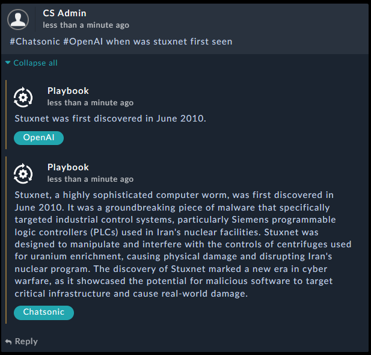
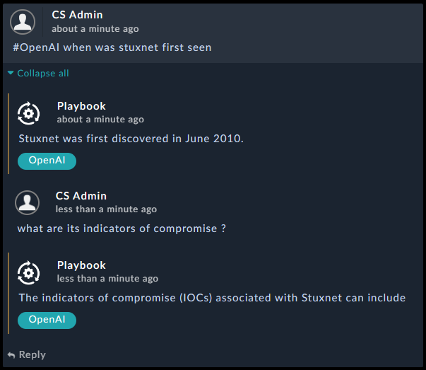

# Release Information

* **Version**: 1.0.0
* **Certified**: No
* **Publisher**: Naili.M
* **Compatible Version**: FortiSOAR v7.2.0 and later

# Overview

The **AI Chatbot** solution pack enables analysts to seek help by asking Machine Learning NLP engines any question.

The Solution Pack also supports conversation mode where analysts could use the comment section of the workspace to ask several contextualized questions and get the responses for them.

Following are the examples of the question and conversation

- Question:

- Conversation:

### Supported AI Connectors
Currently the below connectors are supported

- **Google Bard**
- **Open AI**
- **Chatsonic**

# Next Steps

| [Installation](./docs/setup.md#installation) | [Usage](./docs/usage.md) | [Contents](./docs/contents.md) |
|----------------------------------------------|--------------------------|--------------------------------|