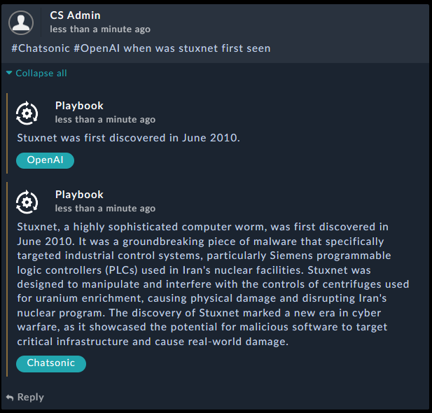
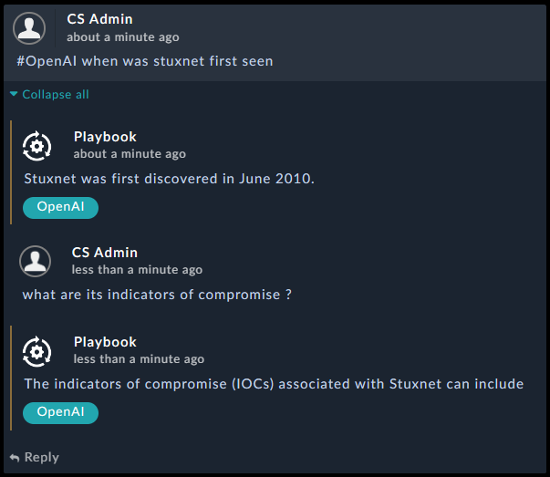

# solution-template-repository

Enables analysts to seek help by asking Machine Learning NLP engines any question. The Solution Pack also supports conversation mode where analysts could use the comment section of the workspace to ask several contextualized questions and get the responses for them.
To ask a question or start a conversation simply start your comment within any alert record with: #NameOfTheAI then your question, exp: #OpenAI how to defend against stuxnet. to carry on the conversation simply reply to the Chatbot answer

- Question:

- Conversation:

TODO: Bard AI support