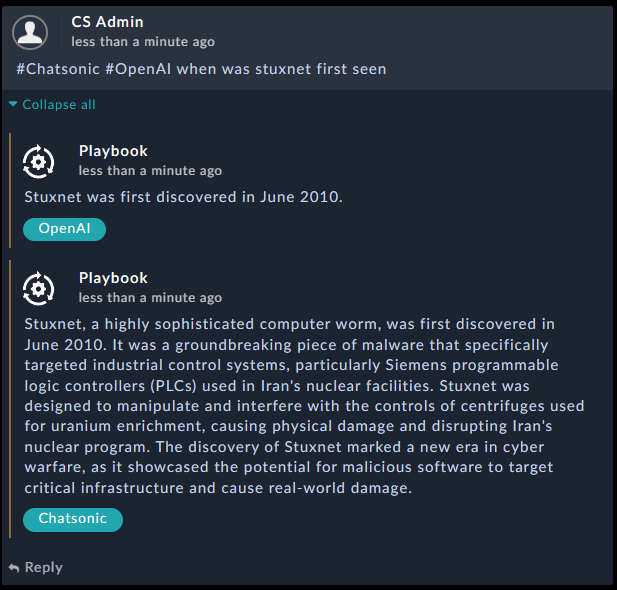
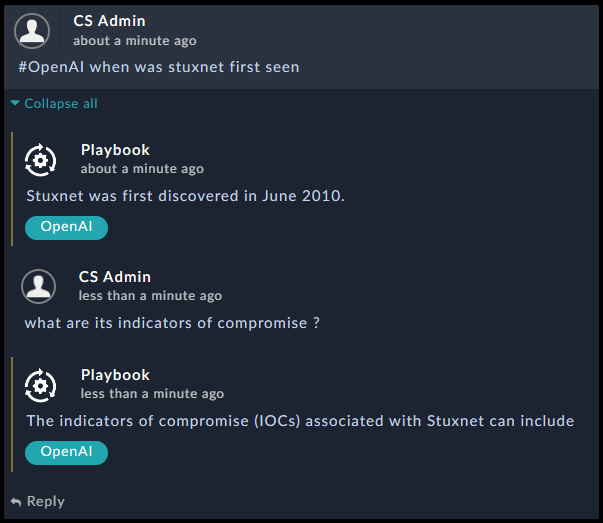

[Home](../README.md) |
 | -------------------------------------------- |

# Usage

The Solution Pack enables analysts to seek assistance by querying Machine Learning NLP engines with any question. Additionally, it supports a conversation mode, allowing analysts to utilize the comment section of the workspace to pose multiple contextualized questions and receive corresponding responses.

To ask a question or initiate a conversation, simply begin your comment within any alert record with "@NameOfTheAI" followed by your question (e.g., "@OpenAI how to defend against Stuxnet"). To continue the conversation, reply to the Chatbot's answer. The solution pack accommodates the use of multiple engines simultaneously by including all relevant tags before the question. For instance, if you require answers from both Chatsonic and Bard, you can commence your comment/question with "@Chatsonic @Bard" followed by your question.

- Question:

- Conversation:

# Next Steps
| [Installation](./setup.md#installation) | [Configuration](./setup.md#configuration) | [Contents](./contents.md) |
| ----------------------------------------- | ------------------------------------------- | --------------------------- |